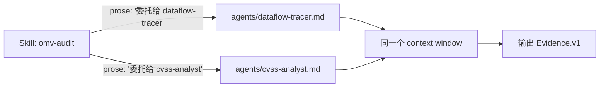
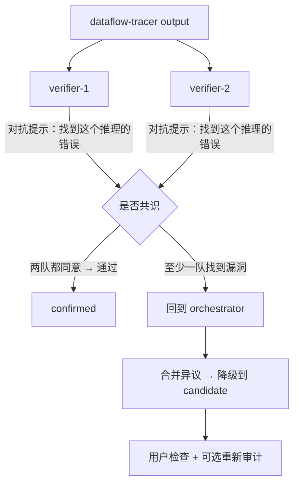

# Agent Team 升级方案：从角色说明书到多 agent 编排

> 对应 registry.yaml 中 5 个 agents `(vuln-scanner / dataflow-tracer / cvss-analyst / dedup-analyst / report-writer)` 的运行时化。
> 当前状态：角色分工齐全、安全边界清晰、方法论成熟，但全部是文档化委托（skill 在 prose 里 natural language 引用），没有真正的 subagent 上下文隔离和并行编排。

---

## 一、核心问题

当前架构里"agents"是一堆 Markdown 说明书，不是运行时：



一个 context 里串行做所有事：读代码、打分 CVSS、查去重——共享同一块 context 记忆、同一个 tools 集合、同一个 token 预算。这不是编排，是"在一个 agent 里 inline 调用多个 role"。

问题和局限：

| 问题 | 影响 |
|---|---|
| **所有角色共用一个 context** | 源文件分析残留可能干扰 CVSS 判断，`report-writer` 可能读到不该读的原始代码 |
| **没有并行 fan-out** | 审计是严格顺序的，实际上 source→sink 分析和去重检索可以并行 |
| **无法做对抗验证** | 同一个 agent 又做论证又做复核，"自己检查自己"几乎无效 |
| **安全边界只有 prose 约束** | "不可运行代码"——但工具列表还是同一个，没有隔离意味着边界只在提示词里 |
| **无法渐进投入** | 一个大 finding 会烧掉整条 token 预算才出中间结果 |

---

## 二、目标架构

### 2.1 抽象层

```
┌──────────────────────────────────────────────────────────────┐
│  Orchestrator Skill (omv-audit, omv-find, omv-report)       │
│  单一入口，调控策略，不参与领域逻辑                            │
│  分阶段：plan → fan-out → collect → judge → output            │
├──────────────────────────────────────────────────────────────┤
│  Subagent Pool (每人独立的 context / tools / token 预算)      │
│  ┌───────────┐ ┌────────────┐ ┌──────────┐ ┌────────────┐   │
│  │ vuln-     │ │ dataflow-  │ │ cvss-    │ │ dedup-     │   │
│  │ scanner   │ │ tracer     │ │ analyst  │ │ analyst    │   │
│  └───────────┘ └────────────┘ └──────────┘ └────────────┘   │
│  ┌──────────┐ ┌─────────────┐ ┌───────────┐ ┌───────────┐   │
│  │ report-  │ │ exploit-    │ │ guard-    │ │ verifier  │   │
│  │ writer   │ │ validator   │ │ checker   │ │ (对抗复核) │   │
│  └──────────┘ └─────────────┘ └──────────┘ └───────────┘   │
├──────────────────────────────────────────────────────────────┤
│  Claude Code Subagent Runtime + 现有 CLI omv 命令            │
└──────────────────────────────────────────────────────────────┘
```

### 2.2 和 Claude Code 原生 subagent 的关系

不造轮子。Claude Code 已经有 `Agent` tool 和 `.claude/agents/*.md` 注册机制（已核实 [官方文档](https://code.claude.com/docs/en/sub-agents)）：

- `.claude/agents/*.md` 文件被**自动发现**（项目目录往上扫），**没有 registry.json**。frontmatter 字段：`name`、`description`（必填）、`tools`、`disallowedTools`、`model`、`permissionMode`、`maxTurns`、`skills`、`mcpServers`、`hooks`、`memory`、`background`、`effort`、`isolation`、`color`、`initialPrompt`。
- 触发方式：**自然语言即可**——prompt 里 "use the dataflow-tracer subagent to …" Claude 自动 delegation；或 `@agent-<name>` 显式触发；或 `claude --agent <name>` 整个 session 用某个 subagent。
- 没有 `allowed_commands` 这个 frontmatter 字段——命令级约束通过 `tools` 白名单 + `disallowedTools` 黑名单 + `PreToolUse` hooks（matcher + 退出码 2 拦截）实现。
- 每个 subagent **独立 context、独立工具权限、独立 prompt cache**。subagent 不继承主对话 history（除非用 fork）。
- subagent 可嵌套（depth 限 5 层）。

所以升级的关键不是重新实现 agent runtime，而是：
1. 把 `agents/*.md` 从"仓库内提示词"变成真正的 `.claude/agents/*.md` 注册文件
2. 每个 subagent 加上**严格的 tools 白名单**（dataflow-tracer 只有 Read，没有 Bash）
3. 在 skill 提示词里用 `Agent tool` 语法替代 prose "委托给"的通知形式
4. 引入 orchestrator 策略：**fan-out / pipeline / 对抗验证 / 循环收敛**

---

## 三、Subagent 角色卡片（升级版）

每个 subagent 定义拆成三部分：**context 边界**（tools 白名单 + 文件可见性）、**契约边界**（输入 schema + 输出 schema）、**策略边界**（允许对用户做什么、不许做什么）。

### 3.1 `dataflow-tracer`

| 维度 | 定义 |
|---|---|
| Tools 白名单 | `Read`（原始源文件）、`WebFetch`（GitHub raw）、`Bash`（仅 `python3 shared/scripts/resolve_source_path.py`） |
| 禁止 | 无 Bash 执行、无 WebSearch、无网络探测 |
| 输入 | `{ finding_id, package_url, version, vuln_class, evidence_hints }`（来自 Evidence.v1 已经填的部分） |
| 输出 | `{ source, sink, guard }`（每项含 file:line + 路段描述 + confidence） |
| Context 上限 | 读 2–5 个文件的源行，输出约 50 行 |
| 约束 | 关键字命中 → low confidence；有精确 file:line → high |

### 3.2 `guard-checker`（新增，从 dataflow-tracer 拆分）

当前 `dataflow-tracer` 同时做"找 sink"和"评估 guard"，这是两个不同难度和能力的事。拆分出来可以：

| 维度 | 定义 |
|---|---|
| Tools 白名单 | 仅 `Read`（已经被 trace 确认过的那 1–2 个关键文件） |
| 输入 | `dataflow-tracer` 输出的 source→sink chain + 同一个文件 |
| 输出 | `{ guard_present, bypassable, bypass_method, confidence }` |
| 策略 | 被要求**默认倾向找到 bypass 路径**（对抗式评估），只有确实找不到时才写 `guard: effective` |

拆分的理由：guard 评估是最容易出错也最值钱的环节，给它自己的 context 和对抗式 bias。

### 3.3 `cvss-analyst`

| 维度 | 定义 |
|---|---|
| Tools 白名单 | 无网络、无文件。推理纯靠提供的 impact 信息 + `cvss-builder.md` |
| 输入 | `{ vuln_class, impact_fields_from_evidence }` |
| 输出 | `{ vector, score, severity, metric_justifications[] }` |
| 约束 | XSS-click 一律 Medium（不可协商）；auth/UI 字段是 unknown 时必须 explain，不许假设最坏 |

### 3.4 `dedup-analyst`

| 维度 | 定义 |
|---|---|
| Tools 白名单 | `WebSearch`（限于 advisory DB 搜索）、`WebFetch`（NVD/GHSA/OSV 页面） |
| 输入 | `{ ecosystem, package_name, vuln_class, affected_version_range }` |
| 输出 | `{ nvd_searched, ghsa_searched, ecosystem_db_searched, existing_cve, near_matches[] }` |
| 约束 | 没有网络时写 `searched: false`，不得臆测 `existing_cve` |

### 3.5 `report-writer`

| 维度 | 定义 |
|---|---|
| Tools 白名单 | `Read`（`report-templates.md` 和 Evidence.v1）+ `Write`（草稿文件） |
| 输入 | 完整 Evidence.v1（经过 orchestrator 确认已通过 validate） |
| 输出 | 平台报告（VulDB/GHSA/OSV/Markdown） |
| 约束 | score<75 → 必须拒绝制作 submission-ready，写 missing 清单 |

### 3.6 `verifier`（新增，对抗验证角色）

**这是整个架构升级最有价值的角色。** 每个 finding 在 confirmed 之前，必须被至少 2 个独立的 verifier subagent 复核。

| 维度 | 定义 |
|---|---|
| Tools 白名单 | 同被复核角色对应的 Tools |
| 输入 | `dataflow-tracer` / `guard-checker` 的输出 + 原始文件 |
| 输出 | `{ agrees, disagreements[], score_adjustment }` |
| 策略 | Prompt 自带 bias："你的工作是**反驳**这个结论。找理由为什么它不成立。" |

---

## 四、Orchestrator 策略矩阵

每个 skill 对 subagent 的编排方式不同，因为每个 skill 的目标不同。

### 4.1 `omv-audit` — 最重编排

```
stage 1: plan (orchestrator alone)
  读取 Evidence.v1，决定：这个 finding 需要 focus 在哪里
  输出：审计计划（哪个子模块、哪个 sink pattern 最可能）

stage 2: fan-out (并行)
  ├─ dataflow-tracer     → {source, sink, guard_notes}
  ├─ dedup-analyst       → {dedup status}
  └─ (如果有依赖 resolve) → resolve_source_path

stage 3: guard-deepdive (dataflow-tracer 完成之后)
  guard-checker          → {bypassable, method}
  # 只在 guard 未明确时调，节省预算

stage 4: cvss (收集完 impact 后)
  cvss-analyst           → {vector, score, severity}

stage 5: 对抗验证 (并行)
  ├─ verifier-1 (复核 source→sink chain)
  └─ verifier-2 (复核 guard 评估)

stage 6: synthesize (orchestrator alone)
  汇聚所有 subagent 输出 → 写 Evidence.v1 + ThreatMap.v1
  如果不是 consensus，降级为 candidate，列出异议
  运行 omv findings validate <id>
```

### 4.2 `omv-find` — 轻编排

```
stage 1: scan (并行 N 个 vuln-scanner)
  └─ 先确定可用 budget。对于 --count N，扫描 N*2 个初始候选

stage 2: rank (orchestrator alone)
  对所有候选按 scoring.md 排序

stage 3: 候选确认 (可选并行)
  对前 N 个候选检查 audit_readiness / novelty
  输出 CandidateList.v1
```

### 4.3 `omv-report` — 顺序编排

```
stage 1: validate (orchestrator)
  omv findings validate → 确认 score >= 75 + confirmed

stage 2: 并行
  ├─ cvss-analyst（检查已有 cvss 一致性）
  └─ dedup-analyst（重新确认去重状态——防止提交前才出现的重复）

stage 3: adversarial critic (可选)
  omv-critic 实际是 verifier 的 pre-submission 版本：
  检查"如果 CNA 拒绝，最可能原因是什么"？
  这个可以拆成独立的 critic subagent

stage 4: report-writer
  渲染选定的报告格式

stage 5: 交叉检查
  对报告再跑一次 verifier，找 "这个报告里哪条 claim 证据最弱"
```

### 4.4 决策树：omv-audit 的编排路径选择

不是每次 audit 都跑全部 6 个阶段。根据已知信息决定：

```text
if dedup 已经是 searched:
    跳过 stage 2 的 dedup-analyst
if evidence.guard 已经明确（非 unknown）:
    跳过 stage 3 guard-checker
if cvss 已经填完:
    跳过 stage 4 cvss-analyst
if 只是检查 source→sink 存在性而不是完整审计:
    跳过 stage 5 对抗验证
```

这种"逐步减少编排"的策略避免了预算浪费，同时保留了最重场景（从头 audit + 未知 guard = 全量编排）。

---

## 五、对抗验证（Adversarial Verification）

这是这套方案的安全内核，与 Evidence.v1 的"unknown 诚实纪律"同层。

### 5.1 为什么需要

大量研究表明 LLM 自检几乎无效：同一个 context 里的"再检查一下"复现相同的幻觉和推理 gap。真正有效的是**独立的、被 biased 去反驳**的另一个 agent。

### 5.2 运作方式



verifier 的 prompt 设计：

```text
你是一个安全研究专家，任务是严格复核一个漏洞审计结论。
你被要求带着对抗性假设工作：假设这个结论是错误的，找到证据支持你的怀疑。

具体复核点：
1. source 真的可控吗？调用者可能从不在攻击者路径上
2. sink 真的危险吗？代码上下文可能已经 sanitize 了
3. source → sink 的路径事实成立吗？中间有没有没考虑的 sanitizer？
4. guard 评估：有没有你觉得能挡住攻击的 guard 被忽略了？

你的回答必须指向具体 file:line。只说"我觉得不对"是不合格的。
```

### 5.3 计分规则

verifier 的结果直接算入 `submission_score` 的扣分：

- 2 个 verifier 都 agree：无扣分
- 1 个 verifier disagree 且证据合理：confidence 降一级（high→medium / medium→low）
- 2 个 verifier 都 disagree：verdict → `plausible` 而非 `proven`，**submission_score −15**
- 如果 verifier 找到了具体的、orchestrator 错过的绕过路径 → 把 verifier 的发现 merge 进去，视作发现增强，不扣分

---

## 六、相关人机协作：Human-in-the-Loop 决策点

编排不是全自动的。以下节点需要用户确认：

| 决策点 | 触发条件 | 呈现给用户 | 默认行为 |
|---|---|---|---|
| **审计确认** | verifier disagree | 列出 diff：dataflow-tracer vs verifier 的具体分歧 | 降级 candidate + 等用户检查 |
| **guard bypass 确认** | guard-checker 声称可绕过 | 展示 bypass 步骤 + 原理 | 等待用户 "yes I can reproduce" |
| **重复 CVE 确认** | dedup-analyst 找到疑似 | 展示被发现的 CVE / GHSA + 版本范围对比 | blocked 直到用户确认"不重复" |
| **score 不足时提交** | 用户直接要求 report | 展示 missing 项 + score | 拒绝制作 submission-ready |
| **budget 告警** | 需要调 extra subagent | "需要多 3 个阅读文件，预算 ~20k tokens" | 等待 yes/no |

这些都基于 Evidence.v1/CLI 已经存在的"验证硬闸门"模式，只是用编排把它变成交互式的。

---

## 七、安全边界增强（相比于现有 prose-only 约束）

| 维度 | 现状 | 升级后 |
|---|---|---|
| Tool 访问 | 全部共享 orchestrator 的工具 | 每个 subagent 白名单独立（dataflow-tracer 无 Bash） |
| 代码执行 | prose 约束"不运行 PoC" | subagent 工具列表里根本没有 `Bash`（防遗漏/遗忘） |
| 伪造 CVE | prose 约束"不编造" | dedup-analyst 的 tools 限定为 WebSearch+WebFetch，写不了假 ID |
| 信息隔离 | 所有角色看到所有文件 | guard-checker 只看到被 trace 确认的 1–2 个文件，不接触无关代码 |
| 对抗验证 | 不存在 | 2 个独立 agent + 默认反驳 bias |

---

## 八、实现路线（按增量，不搞大爆炸）

### Phase 1（已完成）— 把 agents 升级为 Claude Code 真 subagent

`.claude/agents/*.md`（项目级）+ 仓内 `agents/*.md`（领域细则手册，被 subagent body 引用为 "domain spec"）。frontmatter 关键字段：

```markdown
---
name: dataflow-tracer        # 必填
description: <use-proactively hint>  # 必填，决定自动 delegation
tools: Read, WebFetch, Bash  # 工具白名单（硬隔离）
model: inherit               # 或 sonnet/opus/haiku/fable/完整 model ID
---
```

同时把 `registry.yaml` 的 `agents:` 段补 `claude_agent:` 字段指向 `.claude/agents/*.md`，并加上 `status: active`。

### Phase 2（已完成）— 加 `verifier` + `guard-checker` 两个新角色

`guard-checker` 从 `dataflow-tracer` 拆出 guard 评估（独立 context + bypass-bias）；`verifier` 全新对抗复核角色（默认反驳）。

### Phase 3（进行中）— 改 skill prompts 让它们真去调 subagent

### Phase 4（~1 周）— Orchestrator strategy + 计分集成

编写 `src/cli/agent-workflow.ts`（参考已有的 `src/cli/workflow.ts` 模式）：

- 实现编排阶段描述（不重新编排 agent，而是生成**告诉 orchestrator 当前阶段的输出 schema**）
- 在 `evidence_score_weights` 里新增 `adversarial_verified` 权重（提议 +5）
- submission_score 扣分规则集成对抗验证结果

### Phase 5（可选）— Dedicated `/omv-audit-agent` 命令

如果需要**纯编排入口**，可以加一个 CLI 命令 `omv agent audit <id>`，不通过 /skill，直接从 CLI 启动编排。

---

## 九、预算与限界

每个 subagent 需要自己的 context：

| Subagent | 预计 token/调用 | 最重场景调用链 |
|---|---|---|
| dataflow-tracer | ~8k-20k | read 2–5 个文件 |
| guard-checker | ~3k-8k | read 1–2 行 guard |
| dedup-analyst | ~4k-12k | 搜索 3 个数据源 |
| cvss-analyst | ~2k-4k | 纯推理 |
| verifier | ~4k-10k | 读 trace 输出 + 1 个文件 |
| report-writer | ~6k-15k | 读 evidence + 模板 |

最重场景（全量 audit）：~5–8 个 subagent，总计 ~40k-80k tokens，~$1-3。
最轻场景（已知 cvss + dedup）：~2 subagent（tracer + verifier），~15k tokens。

可以设置 `--budget light|normal|deep` 来控制编排深度（对应：省去对抗验证 / 标准 / 双 verifier）。

---

## 十、和现有系统的集成点

| 现有组件 | 升级后的作用 |
|---|---|
| `src/cli/findings.ts` | 保持 `validate` / `computeEvidenceScore` / `computeSubmissionScore` 不变，orchestrator 完后调它 |
| `src/cli/workflow.ts` | 和 subagent 编排不冲突——workflow 是数据爬取工作流，subagent 是审计分析工作流 |
| `contracts/evidence.v1.yaml` | 新增 `adversarial_verified` 字段（optional），供 submission_score 计算用 |
| `registry.yaml` | agents 段扩展为 active 并注册到 `.claude/agents/registry.json` |
| `Contracts thream-map.v1.yaml` | 不变，verifier 可以引用它来验证 dataflow |

---

## 十一、不做的事（明确 scope）

| 不做 | 原因 |
|---|---|
| 自定义 agent runtime | Claude Code 的 Agent tool + `.claude/agents/*.md` 已够用，不造轮子 |
| 多轮对话 agent（带 memory） | Subagent 无记忆、无状态——每次启动纯粹基于输入，防止上下文漂移 |
| 自动 patch 生成 | 超出"passive research + local reproduction"的安全边界 |
| 批量大规模扫描 | 保持"每条 finding 独立编排"的粒度 |
| Subagent 互相通信 | 全部通过 orchestrator 中介，保持编排的 Determinism |
